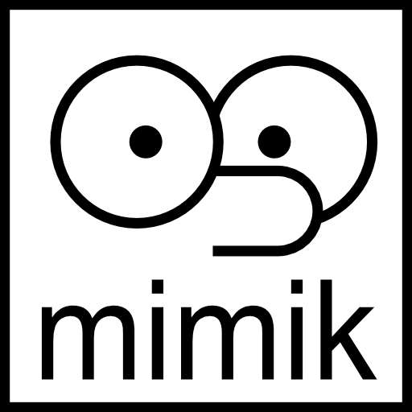
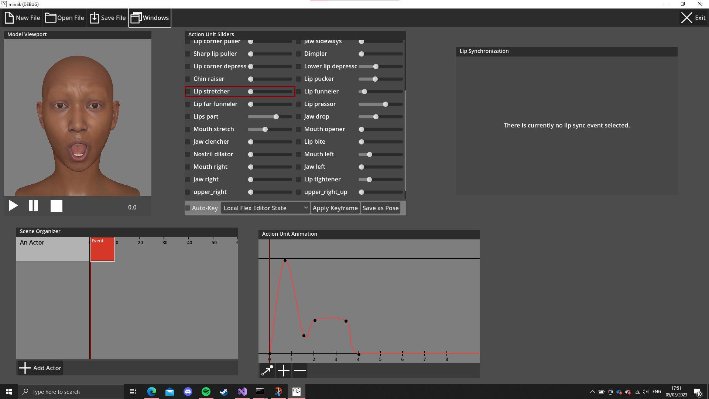

# mimik
Mimik ist ein Programm zur Erstellung von Blend-Shape-basierten Gesichtsanimationen. Es ist auf das FACS (Facial Animation Coding System) ausgelegt und benötigt ein entsprechendes Setup des 3D-Modells, für welches die Animationen erstellt werden sollen.

## Features
Mittels Slidern können einzelne Gesichtszüge (bzw. Action Units) manipuliert werden. Keyframing und Animationskurven erlauben das Animieren des Gesichts. Lippensynchrone Animationen können automatisch generiert werden. Hierbei extrahiert die Library _Pocketsphinx_ automatisch die Phoneme, wobei die Qualität der Ergebnisse stark schwanken kann. 

## Details zur Implementation
Als Framework wird Godot 4 (Version beta6) verwendet. Ein großer, grundlegender Teil des Programm ist in C++ unter Verwendung des Systems _GDExtension_ verfasst (zu finden unter extension/src). Der Rest ist in GDScript, der Godot-eigenen Skriptsprache geschrieben (unter client/WindowContent/*.gd).

